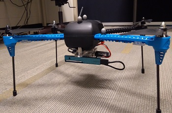
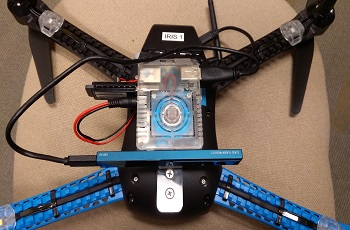

# Objective: 
Detection of a electrical panel door using a Intel Realsense camera and Opencv libraries. 

Project is focused towards incorporating this technology into a drone for assisting it to open the door in air autonomously. 
Drones are being used extensively for surveillance and reconnaissance tasks.
But in the recent past they are also being employed for interacting physically with the environment.
This can involve tasks like picking up packages or boxes, mounting some sensor on a wall or opening doors while hovering.
Several sophisticated end effectors have also been designed for this purpose. 
But for all of them to work the drone needs to identify the target object in front of it.
So the focus of this project is to identify an electrical panel door and its door handle and measure the distance of the drone from it.
This information will be later used (in a separate project) by the drone for controlling its position and the movement of its end effector to grab the door handle and pull open the door.

This project is only to about the image processing part to identify and electrical panel door. 
The camera to be used should be small and light, so that it can be put on a drone. So we selected the Intel Realsense Depth camera for this purpose.

# Requirements: 
* Algorithm should be able to run in real time on a laptop as well as on a sigle board computer (without any dependence on GPUs).
* Algorithm should be able to detect the electrical panel door and show the position of the door handle.
* The distance of the door handle from the camera should also be calculated continuously in real time.
* All software should be open source. 
* Overall setup should be battery operated and should be small and light enough to be mounted on a drone. 

# Current Framework: 
* Opencv libraries, Ubuntu 16.04. 
* Intel Realsense R200 Depth Camera.
* Odroid XU4 single board computer, Laptop computer.

#### Intel Realsense R200 Depth Camera and Odroid XU4:

#### Overall Setup mounted on the test Drone:
**[ Odroid is inside the white case ]**

# Algorithm Description: 
  
## Algorithm for detecting stairs moving down (Down-stairs): 
This algorithm only considers the first two steps of the stairs. This is done for two reasons.  
1. So that it can detect the stairs that have only two steps.  
2. As a person climbs down, the number of steps visible to him becomes fewer. And just before reaching the ground, only two  
or three steps might be visible.  

**So, why not make the algorithm try to detect only one step then?** 
Detection of a single step is also possible, but there would be a lot of false detections. There are several objects 
that resembles a stair with a single step, like a concrete beam lying on the ground or the edges of the sidewalk beside the streets, etc. Hence, considering only the first two steps of the stairs, seems to be the optimal choice. 

### Preprocessing of the images for down-stairs: 
To filter out the unwanted objects like walls or handrails, we consider only the lower central part of the image for our  
analysis (the interest region). This interest region is shown below (right image is **BGR image**, left is **Depth image**). 

 

### Feature Extraction for “down-stairs”: 
Multiple parallel scans of the points in the interest region are taken (the dots in the images). 
The depths of the scanned points are plotted against the y-coordinates of their corresponding pixels, which gives a plot like  
the following: 

 

The plot shows a sudden change in depth of the scanned points at the locations corresponding to the edges of the stairs.  
These points adjacent to the edges are the feature points. 
Since only first two steps are considered, so the two points adjacent to the first step, and the two adjacent to the second,  
will comprise a set of features for a single scan in the interest region. The points A and B show the location of the first  
and the second edges of the stairs. 

An example of the four feature points of one particular scan is shown in the following figure. 

 

P1 = Scanned Point just **below** the **first edge** location. 
P2 = Scanned Point just **above** the **first edge** location. 
P3 = Scanned Point just **below** the **second edge** location. 
P4 = Scanned Point just **above** the **second edge** location. 

### Parameterized model of “down-stairs”: 
In practice, there might be some other objects in the scene that can also have edges, e.g. the edge of a shelf, chair, set of drawers, etc. So, to know that these features truly represent a “down-stair”, we define a set of functions that describes the relationship between these features which constitutes a parameterized model of the “down-stairs”. 

**1. FUNCTION_1:** 
P2.depth = 𝜃00 + 𝜃10 * P1.y + 𝜃20 * P1.depth. 

Function of depth of point P2 in terms of the y-coordinate and depth of point P1. 

**2. FUNCTION_2:** 
P3.depth = 𝜃01 + 𝜃11 * P1.y + 𝜃21 * P1.depth. 

Function of depth of point P3 in terms of the y-coordinate and depth of point P1. 

**3. FUNCTION_3:** 
P3.y = 𝜃02 + 𝜃12 * P1.x + 𝜃22 * P1.y + 𝜃32 * P1.depth. 

Function of the y-coordinate of point P3 in terms of the x-coordinate, y-coordinate, and depth of point P1. 

**4. FUNCTION_4:** 
AvD_P2_P3 = 𝜃03 + 𝜃13 * P2.x + 𝜃23 * P2.y + 𝜃33 * P1.depth. 

Average depth of all the points between P2 and P3 is represented by AvD_P2_P3.  
Function of the average depth of all the points between P2 and P3 in terms of the x-coordinate, y-coordinate, and depth of  
point P2. 

All the 𝜃 are parameters that are determined by linear regression over 53 different example images of the actual REAL and  
MODEL “down-stairs”. 

**Parameters: MODEL “down-stairs”:** 

𝜃00 = 164.2443 ; 𝜃10 = -0.2036 ; 𝜃20 = 1.0059 

𝜃01 = 184.0495 ; 𝜃11 = 0.0413 ; 𝜃21 = 0.9777 

𝜃02 = -47.0351 ; 𝜃12 = 0.0163 ; 𝜃22 = 0.7540 ; 𝜃32 = 0.075 

𝜃03 = 13.7039 ; 𝜃13 = -0.0537 ; 𝜃23 = 0.082 ; 𝜃33 = 0.9937 

**Parameters: REAL “down-stairs”** 

𝜃00 = 252.523 ; 𝜃10 = -0.3195 ; 𝜃20 = 0.9829 

𝜃01 = 334.1068 ; 𝜃11 = -0.0223 ; 𝜃21 = 0.985 

𝜃02 = -85.0389 ; 𝜃12 = -0.0056 ; 𝜃22 = 0.7835 ; 𝜃32 = 0.041 

𝜃03 = 40.4137 ; 𝜃13 = -0.0064 ; 𝜃23 = 0.1426 ; 𝜃33 = 1.001 

### How the algorithm works: 
The interest region is first extracted from every frame of the BGR and depth video feed of the Kinect. This region is then  
scanned to search for feature points. If there are at least two locations along these scans, where the depth changes  
abruptly, then (assuming them to be potential stair edges) the points adjacent to these locations are extracted as the four  
feature points (P1, P2, P3, P4). The x and y coordinates and the depths of these points are saved for further analysis.  
Their values are then plugged into the functions of the parameterized model. Now, the algorithm already knows what the  
output values of these functions should be if the camera is really looking at the model “down-stairs”. If we observe that  
the outputs of the functions are within some close acceptable thresholds of those values, then the algorithm declares that  
the “model down-stairs” is detected. If there was some other object that the camera is looking at, then the functions of the  
parameterized model will never give proper values all at the same time. Once a stair is found, the edges are marked, and the  
distance of the edges from the camera is displayed, as shown in following figures. 

**Program modes:** 
The program can run in two modes – the **MODEL stairs detection mode** and the **REAL stairs detection mode**. The selected  
mode is shown near the top right side of the display window. By default the program starts up in the MODEL stairs mode.  
Pressing the ‘r’ key on the keyboard switches it into REAL stairs detection mode. Pressing ‘m’ switches the program back to  
MODEL stairs mode. The distance of the stairs from the camera is shown near the top left side of the display window. 

 

 

## Algorithm for detecting stairs moving up (Up-stairs): 

### Assumptions and Conventions: 
Here also the first two steps of the stairs are considered for the same reason. 

### Preprocessing of the images for: MODEL “up-stairs”: 
Interest region for filtering out the unwanted objects is shown in the following figure. 

 

### Feature Extraction from the images for up-stairs: 
Multiple parallel scans of the points in the interest region are taken. The black and red dots in the depth and BGR images  
shows these scanned points. 
Plotting the depths of the scanned points against the y-coordinates of their corresponding pixels gives the following  
figure. 

 

There is a change in the slope of the graph at the locations corresponding to the inner edges and also at their outer edges  
of the steps. At each of the inner edges the graph hits a local maxima, and at each outer edge, there is a local minima.  
These maxima and minima points will be the feature points. The points D and B show the maxima points and C and A show the minima points. 

An example of the four feature points of one scan is shown in the following figure. 

P1 = Scanned Point on the **inner edge** of the **first step** (first maxima). 
P2 = Scanned Point on the **outer edge** of the **first step** (first minima). 
P3 = Scanned Point on the **inner edge** at the **second step** (second maxima). 
P4 = Scanned Point on the **outer edge** of the **second step** (second minima). 

 

### Parameterized model of up-stairs: 
To know that these features truly represent “up-stairs”, we define a set of functions that describes the  
relationship between these features. This constitutes a parameterized model of the Model “up-stairs”. 

**1. FUNCTION_1:** 
P2.depth = 𝜙00 + 𝜙10 * P1.y + 𝜙20 * P1.depth. 

Function of depth of point P2 in terms of the y-coordinate and depth of point P1. 

**2. FUNCTION_2:** 
P3.depth = 𝜙01 + 𝜙11 * P1.y + 𝜙21 * P1.depth. 

Function of the depth of point P3 in terms of the y-coordinate and depth of point P1.\ 

**3. FUNCTION_3:** 
P3.y = 𝜙02 + 𝜙12 * P1.x + 𝜙22 * P1.y + 𝜙32 * P1.depth. 

Function of the y-coordinate of point P3 in terms of the x-coordinate, y-coordinate, and depth of point P1. 

**4. FUNCTION_4:** 
AvD_P2_P3 = 𝜙03 + 𝜙13 * P2.x + 𝜙23 * P2.y + 𝜙33 * P1.depth 

Average depth of all the points between P2 and P3 is represented by AvD_P2_P3.  
Function of the average depth of all the points between P2 and P3 in terms of the x-coordinate, y-coordinate, and depth of  
point P2. 

**5. FUNCTION_5:** 
Slope_P1_P3 = (P1.depth – P3.depth) / (P1.y – P3.y) 

Slope of the line joining the points P1 and P3 is referred to as Slope_P1_P3. 

**6. FUNCTION_6:** 
Slope_P2_P4 = (P2.depth – P4.depth) / (P2.y – P4.y) 

Slope of the line joining the points P2 and P4 is referred to as Slope_P2_P4. 

All the 𝜙 are parameters that are determined by linear regression over 59 different example images of the actual REAL and  
MODEL “up-stairs”. 

**Parameters: MODEL “up-stairs”** 

𝜙00 = -97.3592 ; 𝜙10 = 0.0585 ; 𝜙20 = 0.9768 

𝜙01 = -36.7519 ; 𝜙11 = 0.0494 ; 𝜙21 = 1.0065 

𝜙02 = -349.7489 ; 𝜙12 = -0.0112 ; 𝜙22 = 1.0507 ; 𝜙32 = 0.2898 

𝜙03 = 28.0292 ; 𝜙13 = -0.0081 ; 𝜙23 = -0.0013 ; 𝜙33 = 1.0301 

**Parameters: REAL “up-stairs”** 

𝜙00 = -220.2735 ; 𝜙10 = 0.0945 ; 𝜙20 = 1.0829 

𝜙01 = -5.9768 ; 𝜙11 = 0.0802 ; 𝜙21 = 1.0612 

𝜙02 = -351.6235 ; 𝜙12 = 0.0031 ; 𝜙22 = 0.9932 ; 𝜙32 = 0.1894 

𝜙03 = 118.7745 ; 𝜙13 = -0.0120 ; 𝜙23 = 0.0253 ; 𝜙33 = 1.0189 

### How the algorithm works: 
The interest region is scanned to search for feature points. If there are at least two local minima and two local maxima  
points along these scans, then (assuming them to be potential stair edges) the points are extracted as the four feature  
points (P1, P2, P3, P4). As described in the previous sections, the x and y coordinates and the depths of these points are  
saved for further analysis. Their values are then plugged into the functions of the parameterized model. If we observe that  
the outputs of the functions are within some close acceptable thresholds of those values, then the algorithm declares that  
the Model “up-stairs” is detected. If there is some other object that the camera is looking at, the functions of the  
parameterized model will never give proper values all at the same time. Once a stair is found, the edges are marked, and the  
distance of the edges from the camera is displayed, as shown in figure below. 

 

 

# Portable Hardware Setup for testing: 
Finally a portable wheeled platform is created for the entire setup. 
This was designed in **Solidworks**. 
The cad drawing and the image of the actual setup is shown below. 
The Solidworks files and images are also present in [solidworks_files](solidworks_files) directory.

**Setup for detecting MODEL stairs:** 

 

**Setup for detecting REAL stairs:** 

 

These are not two different setups. The upper part of the platform containing the kinect can be detached and mounted at the  
top of the lower section to configure it for REAL stairs. 
The kinect is also powered by a 12v battery to make the entire setup portable. 

# Results: 
The final working of the [detect_stairs](codes/detect_stairs.cpp) 
can be seen in the videos in the [test_videos](testing_videos) directory. 

The videos can also be viewed on **Youtube** using the following links: 

* [video of detection of MODEL DOWN stairs](https://www.youtube.com/watch?v=G00To1GtQtI&feature=youtu.be) 

* [video of detection of MODEL UP stairs](https://www.youtube.com/watch?v=KZ8WtoTPJZ0&feature=youtu.be) 

* [video of detection of REAL DOWN stairs](https://www.youtube.com/watch?v=ioiHB1MyEKs&feature=youtu.be) 

* [video of detection of REAL UP stairs](https://www.youtube.com/watch?v=NkCATsoHP4I&feature=youtu.be) 

Some snaps of the working system (for real stairs) can be seen in the following gifs.

**REAL stairs (DOWN):** 

 

**REAL stairs (UP):** 

 

# Future Improvements:  
* Use of a smaller depth camera like the Intel Realsense. 
* Use of compact single board computer like the Odroid or Raspberri Pi or Nvidia Jetson etc. 
* Use of Deep Learning framework. 
* Integrate the camera to some kind of eyewear (like glasses), so that stairs are still visible if the user wears trousers. 

  

 