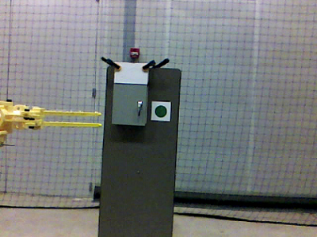
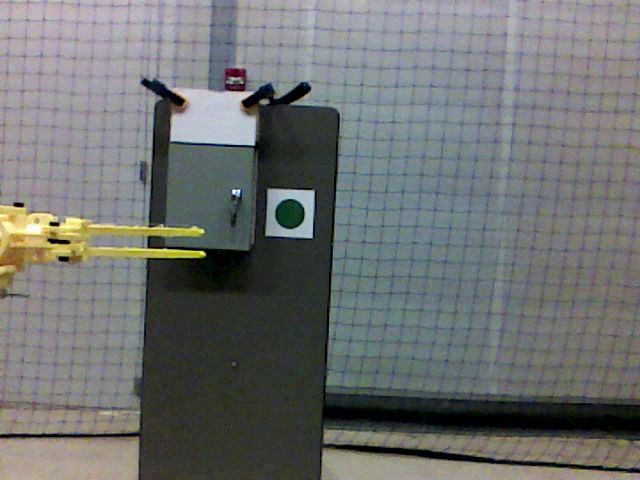
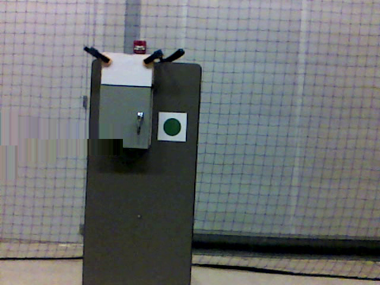

# Objective: 
Detection of a electrical panel door using a Intel Realsense camera and Opencv and Scikit learn libraries. 

Project is focused towards incorporating this technology into a drone for assisting it to open the door in air autonomously. 
Drones are being used extensively for surveillance and reconnaissance tasks.
But in the recent past they are also being employed for interacting physically with the environment.
This can involve tasks like picking up packages or boxes, mounting some sensor on a wall or opening doors while hovering.
Several sophisticated end effectors have also been designed for this purpose. 
But for all of them to work the drone needs to identify the target object in front of it.
So the focus of this project is to identify an electrical panel door and its door handle and measure the distance of the drone from it.
This information will be later used (in a separate project) by the drone for controlling its position and the movement of its end effector to grab the door handle and pull open the door.

This project is only about the image processing part to identify and electrical panel door. 
The camera to be used should be small and light, so that it can be put on a drone. So we selected the Intel Realsense Depth camera for this purpose.

# Requirements: 
* Algorithm should be able to run in real time on a laptop as well as on a sigle board computer (without any dependence on GPUs).
* Algorithm should be able to detect the electrical panel door and show the position of the door handle.
* The distance of the door handle from the camera should also be calculated continuously in real time.
* All software should be open source. 
* Overall setup should be battery operated and should be small and light enough to be mounted on a drone. 

# Current Framework: 
* Opencv, SciKit Learn and SciKit Image libraries, Ubuntu 16.04. 
* Intel Realsense R200 Depth Camera.
* Odroid XU4 single board computer, Laptop computer.

#### Intel Realsense R200 Depth Camera and Odroid XU4:

#### Overall Setup mounted on the test Drone:
**[ Odroid is inside the white case ]**

The next figure shows the electrical panel door mounted on a dummy wall in the lab. 
The figure also shows the yellow claws with fingers to grab the door handle. 
This will be later attached to the drone. For now it is only mounted on a stand so that the overall setup looks like a real image as seen by the realsense camera.
The claws will be visible from one side of the frame, as it is supposed to be mounted on one arm of the drone.

# Algorithm Description: 
The algorithm goes through several stages for detecting the box.

### Stage 1:
The videos from the realsense is read as a numpy array. This included both the rgb frame as well as the depth frame.
The depth frame is of the same dimension as the rgb frame (640 x 480 pixels) but each pixel in the frame has a value equal to the distance of the object represented by that pixel from the camera in mm.

### Stage 2:
When the box is nearer to the camera, the claws will be obstructing parts of the box. But it is already known at which pixels the claws are visible.
So the pixels for the claws are replaced by the other surrounding background pixels to that the overall frame has no visible claws and only the box and the background are visible. 
The following figure shows the original frame and the processed frame with the claws removed. This frame will be used for further processing.

